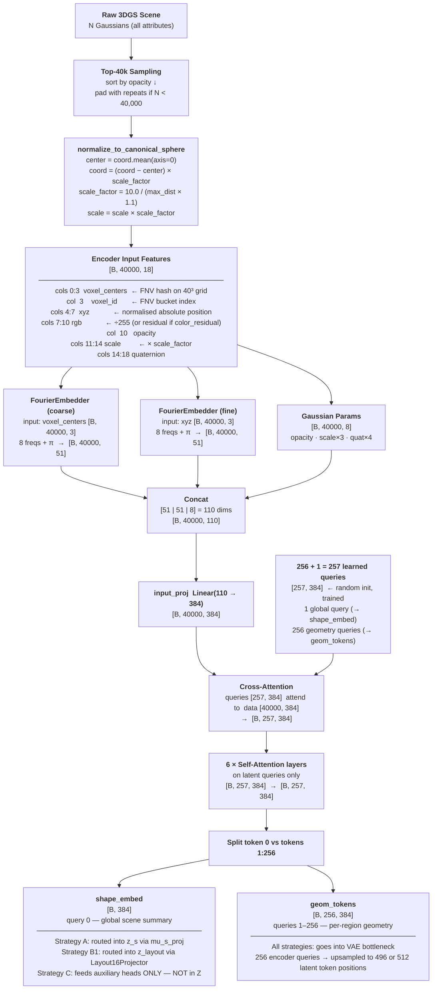
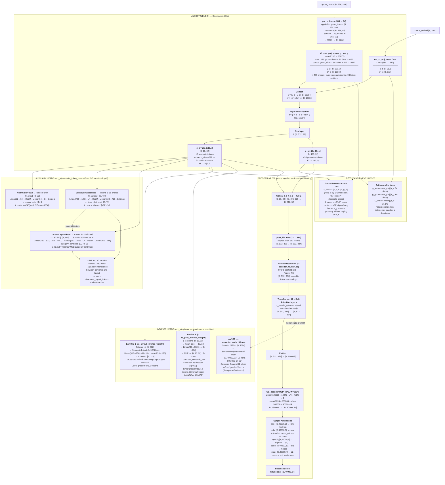
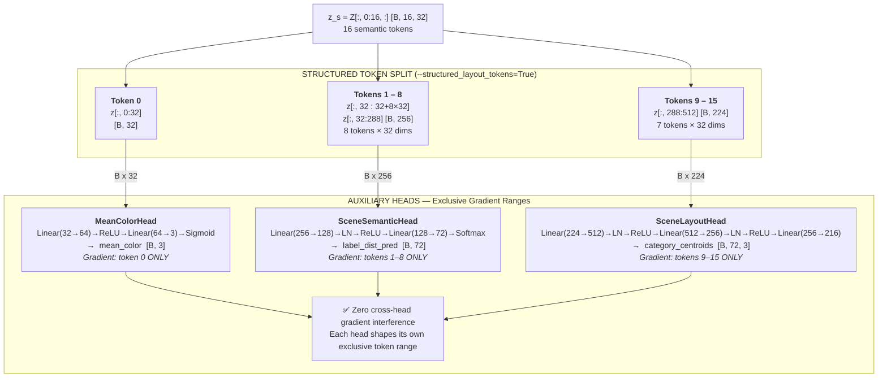
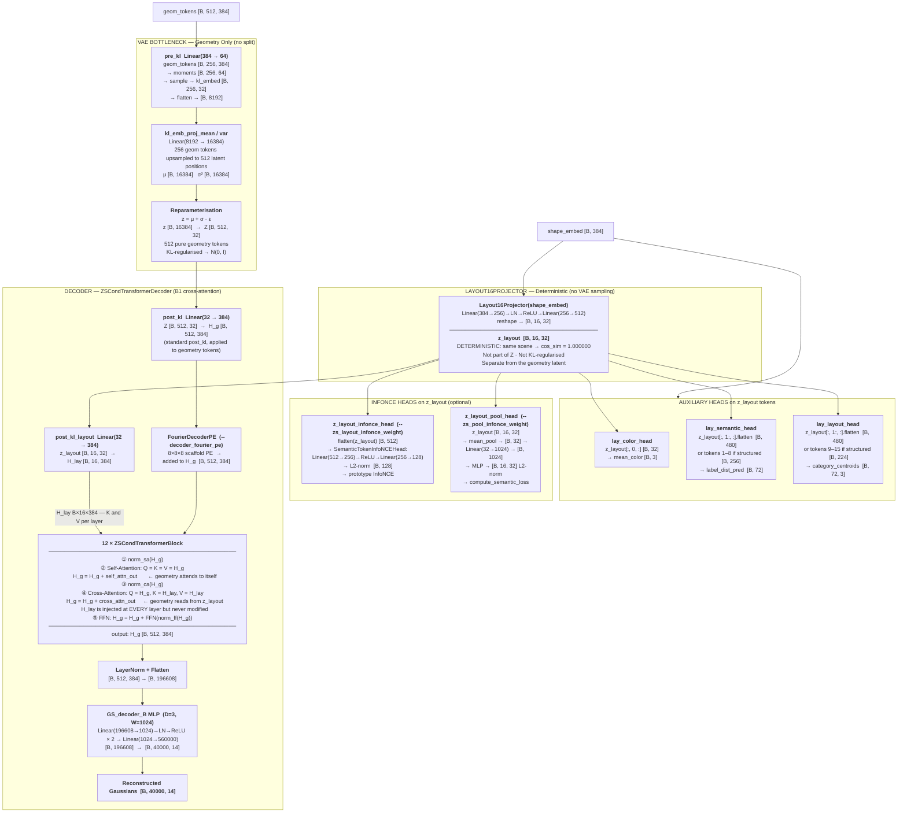
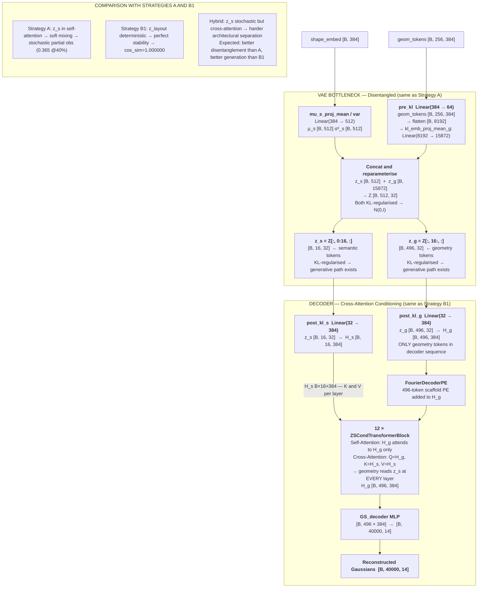
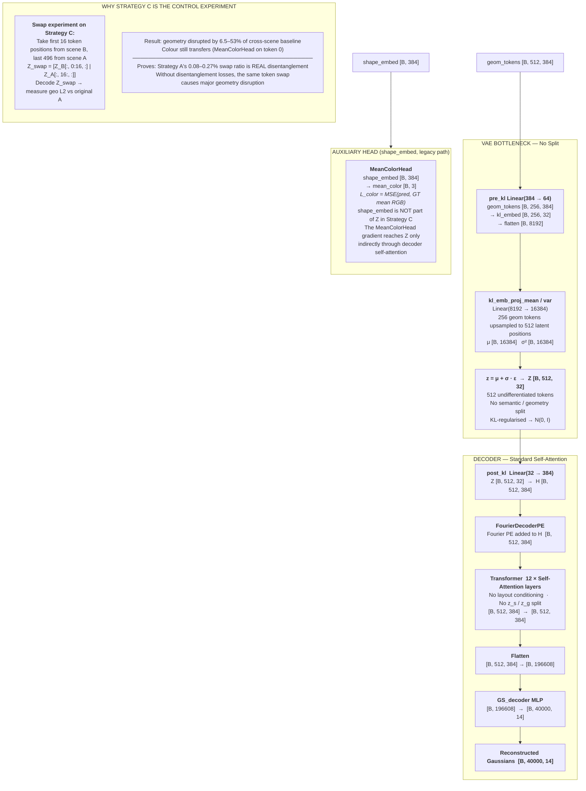
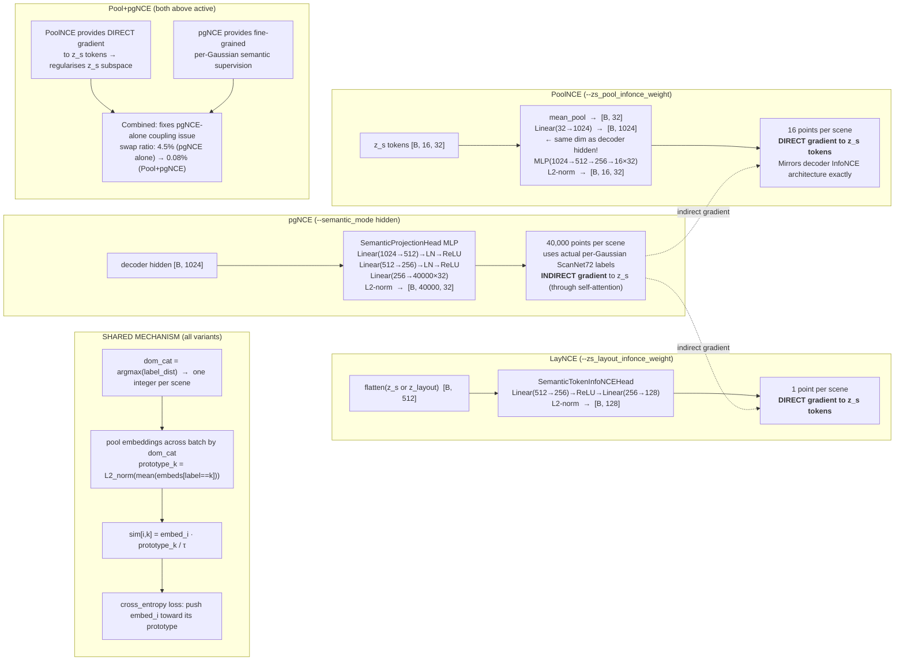
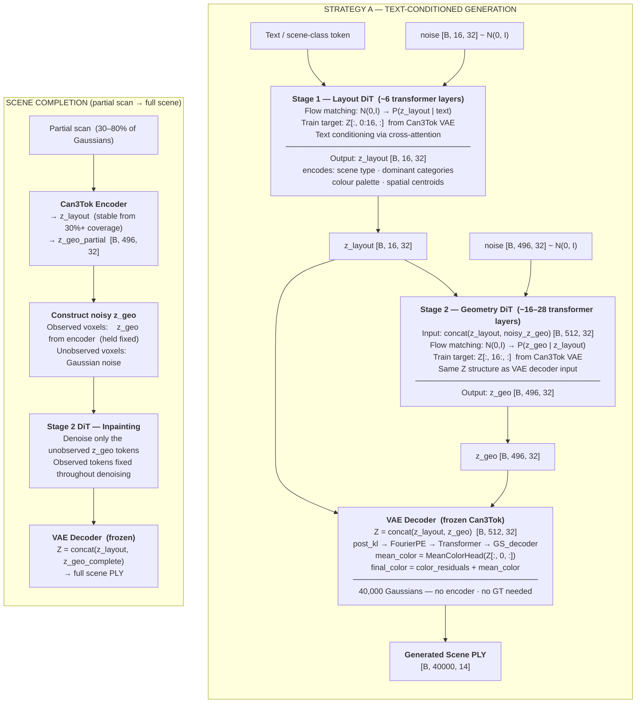
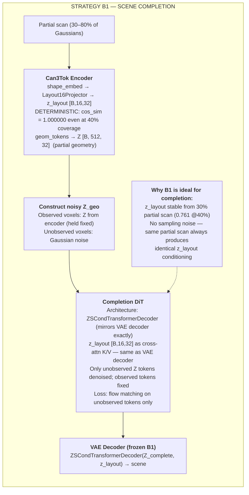
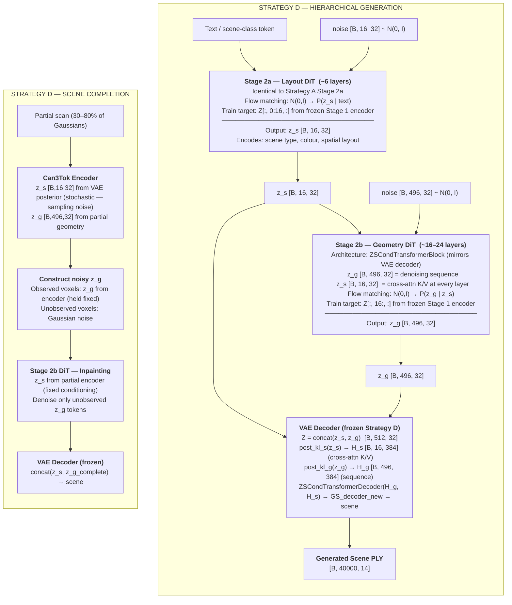

# Can3Tok VAE — Semantic-Aware 3D Gaussian Scene Tokenizer

A Perceiver-based Variational Autoencoder encoding full indoor 3DGS scenes into a
structured, disentangled latent space. Designed as Stage 1 of a two-stage hierarchical
scene generation pipeline.

Built on [SceneSplat-7K](https://arxiv.org/abs/2501.01895).

---

## Table of Contents

1. [Architecture at a Glance](#1-architecture-at-a-glance)
2. [Shared Encoder Pipeline](#2-shared-encoder-pipeline)
3. [Strategy A — Disentangled VAE (without Structured Split)](#3-strategy-a--disentangled-vae-without-structured-split)
4. [Strategy A — Disentangled VAE (with Structured Split)](#4-strategy-a--disentangled-vae-with-structured-split)
5. [Strategy B1 — Cross-Attention Conditioning](#5-strategy-b1--cross-attention-conditioning)
6. [Strategy D — Hybrid (A Bottleneck + B1 Decoder)](#6-strategy-d--hybrid-a-bottleneck--b1-decoder)
7. [Strategy C — Baseline](#7-strategy-c--baseline)
8. [InfoNCE Loss Variants](#8-infonce-loss-variants)
9. [Training Configuration](#9-training-configuration)
10. [Loss Function Summary](#10-loss-function-summary)
11. [Second-Stage Generation Pipeline](#11-second-stage-generation-pipeline)
12. [Dataset](#12-dataset)
13. [Ablation Results](#13-ablation-results)
14. [Key Flags Reference](#14-key-flags-reference)
15. [Code Structure](#15-code-structure)

---

## 1. Architecture at a Glance

| Strategy | Z content | Decoder conditioning | Disentangle losses | Partial obs @40% |
|---|---|---|---|:---:|
| **C** — Baseline | 512 geometry tokens | None | None | N/A |
| **A** — Disentangled | 16 layout + 496 geometry | Self-attention (all 512 together) | L_cross + L_ortho | 0.20–0.37 |
| **B1** — Cross-Attn | 512 geometry tokens | Cross-attention K,V per layer | None (structural) | **0.761** |
| **B2** — Additive | 512 geometry tokens | Broadcast additive bias | None | −0.06 (failed) |
| **D** — Hybrid | 16 layout + 496 geometry | Cross-attention K,V per layer | L_cross + L_ortho | ~0.37–0.76 (expected) |

All strategies share the same encoder. The decoder strategy is selected by flags.

> **Original Can3Tok vs this work.** The published Can3Tok (ICCV 2025) uses a single-stream
> Strategy C baseline: 256 encoder geom queries → projected to 512 decoder tokens, standard
> self-attention, no z_s / z_g split. shape_embed feeds only auxiliary heads — it is **not**
> part of the generative latent Z. Our contribution is (1) routing shape_embed into a dedicated
> z_s subspace of Z via `mu_s_proj_mean` (Strategy A), (2) enforcing disentanglement with
> L_cross + L_ortho + InfoNCE, and (3) the cross-attention conditioning decoder (Strategy B1)
> which extracts z_layout deterministically from shape_embed without entering Z.

---

## 2. Shared Encoder Pipeline

All three strategies use this encoder identically.



---

## 3. Strategy A — Disentangled VAE (without Structured Split)

**Flags:** `--latent_disentangle --semantic_token_heads`

The VAE bottleneck splits into **z_s** (16 semantic tokens, 512 dims) and **z_g**
(496 geometry tokens, 15,872 dims). Both are KL-regularised. All 512 tokens are
concatenated and passed through the decoder together via self-attention.



---

## 4. Strategy A — Disentangled VAE (with Structured Split)

**Flags:** `--latent_disentangle --semantic_token_heads --structured_layout_tokens`

Everything is identical to §3 except the auxiliary heads. Each head now receives
an **exclusive** token range — gradients from one head cannot interfere with another.



**Token assignment table:**

| Tokens | Dims | Head | Loss | Input to head |
|--------|------|------|------|---|
| Token 0 | [B, 32] | `MeanColorHead` | `L_color` = MSE vs GT mean RGB | `z[:, 0:32]` |
| Tokens 1–8 | [B, 256] | `SceneSemanticHead` | `L_sem` = KL vs GT label dist | `z[:, 32:288]` |
| Tokens 9–15 | [B, 224] | `SceneLayoutHead` | `L_layout` = masked MSE vs GT centroids | `z[:, 288:512]` |

**Without** `--structured_layout_tokens` (Strategy A §3): SceneSemanticHead **and**
SceneLayoutHead both receive `z[:, 32:512]` (same 480 floats). The gradient from one
head modifies the exact same parameters as the other — they interfere. The structured
split eliminates this completely.

The encoder, bottleneck, disentanglement losses, InfoNCE heads, and decoder are
**identical** to §3. Only the head input ranges change.

---

## 5. Strategy B1 — Cross-Attention Conditioning

**Flags:** `--decoder_layout_cross_attn`  (without `--latent_disentangle`)

Z contains **512 pure geometry tokens**. A separate deterministic
`Layout16Projector` maps `shape_embed → z_layout [B, 16, 32]` without VAE sampling.
This z_layout conditions every decoder transformer layer as Keys and Values.

Because `Layout16Projector` is a deterministic MLP, encoding the same scene twice
produces **identical** z_layout (cosine similarity = 1.000000). This enables stable
scene completion from partial observations (cosine sim 0.761 at 40% coverage).



**Key difference between Strategy A and B1:**

| Property | Strategy A | Strategy B1 |
|---|---|---|
| z_layout source | VAE posterior (stochastic) | Layout16Projector (deterministic) |
| z_layout inside Z? | Yes — Z[:,0:16,:] | No — separate tensor |
| KL on z_layout | Yes (part of z_s) | No |
| Decoder z_layout role | One of 512 self-attention tokens | K, V in cross-attention every layer |
| Same-scene stability | cos_sim ≈ 0.97 (sampling noise) | cos_sim = 1.000000 exactly |
| Partial obs @40% | 0.20–0.37 | **0.761** |

---

## 6. Strategy D — Hybrid (A Bottleneck + B1 Decoder)

**Flags:** `--latent_disentangle --decoder_zs_cross_attn --semantic_token_heads --structured_layout_tokens`

Strategy D combines the two best properties across all strategies:

- **From Strategy A:** both z_s and z_g pass through the VAE bottleneck (KL-regularised toward
  N(0,I)). The full Z [B, 512, 32] has a generative path — a single Stage-2 DiT can generate
  both z_s and z_g from scratch for unconditional scene generation.
- **From Strategy B1:** z_g tokens [B, 496, 32] are the only decoder sequence input; z_s tokens
  [B, 16, 32] condition every decoder layer as cross-attention K, V via `ZSCondTransformerDecoder`.
  The architectural separation is harder than the soft self-attention mixing in Strategy A.

**Why the original run failed, and why it should work now:**
An early experiment with `decoder_zs_cross_attn=True` produced near-zero disentanglement.
The cause: z_s received gradient only through the cross-attention path during reconstruction —
indirect and too weak without explicit semantic targets. z_s degenerated to near-constant noise
and cross-attention weights collapsed toward zero.

The fix is LayNCE and PoolNCE, which give **direct** gradients to all 16 z_s tokens every step,
independent of the decoder. These force z_s to organise by scene type before reconstruction
sees it. EncDiff (NeurIPS 2024 Spotlight) provides theoretical support: cross-attention between
concept tokens and geometry is itself a strong disentanglement inductive bias, provided the
concept tokens carry meaningful signal.



**Key difference from Strategy A:**

| Property | Strategy A | Strategy B1 | Hybrid |
|---|---|---|---|
| z_s source | VAE posterior | Layout16Projector | VAE posterior |
| z_s in Z? | Yes (tokens 0–15) | No (separate) | Yes (tokens 0–15) |
| KL on z_s | Yes | No | Yes |
| Decoder sequence | all 512 tokens | 512 geo tokens | 496 geo tokens only |
| z_s decoder role | One of 512 self-attn tokens | K, V in cross-attn | K, V in cross-attn |
| Generation possible? | Yes (Z is full) | Only conditioned | Yes (Z is full) |
| Partial obs expected | ~0.37 @40% | 0.761 @40% | Between A and B1 |

---

## 7. Strategy C — Baseline

**Flags:** none (all strategy flags `False`)

512 pure geometry tokens. No disentanglement. No layout conditioning. Used as the
control experiment to prove Strategy A's disentanglement is real.



---

## 8. InfoNCE Loss Variants

All variants use **cross-batch dominant-category prototype InfoNCE**:
`dom_cat(b) = argmax(label_dist[b])`. They differ in *what* is supervised and whether
the gradient path to z_s/z_layout is direct or indirect.



**Comparison table:**

| Variant | Flag | Points/scene | Labels | Gradient to z_s | Visualisation PLY |
|---|---|:---:|---|:---:|---|
| LayNCE | `--zs_layout_infonce_weight` | 1 | dom_cat | **Direct** | `zs_layout_epoch_NNN.ply` |
| PoolNCE | `--zs_pool_infonce_weight` | 16 | dom_cat | **Direct** | `zs_pool_epoch_NNN.ply` |
| pgNCE | `--semantic_mode hidden` | 40,000 | per-Gaussian | Indirect | `scene{i}_semantic_infonce.ply` |
| Pool+pgNCE | both above | 40,016 | both | **Direct + Indirect** | both above |

---

## 9. Training Configuration

```yaml
# Architecture (shapevae-256.yaml)
# ─────────────────────────────────────────────────────────────────────────
# IMPORTANT: num_latents=256 refers to the number of GEOMETRY encoder queries.
# The encoder has 1 + 256 = 257 total queries:
#   query 0 → shape_embed [B, 384]   (global scene summary)
#   queries 1–256 → geom_tokens [B, 256, 384]   (per-region geometry)
# The 512-token decoder latent Z is produced by upsampling:
#   Strategy A:  shape_embed → mu_s_proj → 16 tokens (z_s)
#                geom_tokens → Linear(8192→15872) → 496 tokens (z_g)
#                concat → Z [B, 512, 32]
#   Strategy B1: geom_tokens → Linear(8192→16384) → 512 tokens
#                shape_embed → Layout16Projector → z_layout [B, 16, 32]  (separate)
#   Strategy C:  geom_tokens → Linear(8192→16384) → 512 tokens
#   Strategy D:  shape_embed → mu_s_proj → 16 tokens (z_s)  [same as A]
#                geom_tokens → Linear(8192→15872) → 496 tokens (z_g)  [same as A]
#                decoder: z_g in sequence + z_s as cross-attn K/V per layer
#                flags: --latent_disentangle --decoder_zs_cross_attn
# ─────────────────────────────────────────────────────────────────────────
num_latents:       256    # geometry encoder queries (total encoder = 257 with shape_embed)
embed_dim:         32     # token dimension in Z; Z always [B, 512, 32]
width:             384    # transformer hidden width throughout
encoder_layers:    6      # CrossAttentionEncoder self-attention layers
decoder_layers:    12     # transformer decoder layers
heads:             12     # attention heads
num_freqs:         8      # Fourier embedding frequencies

# Training (gs_can3tok_2.py)
batch_size:        64     # per GPU × 2 H100s = 128 effective
learning_rate:     1e-4   # cosine decay to lr × lr_min_ratio
lr_min_ratio:      0.1    # floor = 1e-5
warmup_steps:      300
kl_weight:         1e-5   # deliberately small — allows large σ for better reconstruction
semantic_dims:     512    # z_s spans first 512 dims of z = 16 tokens × 32 dims
cross_recon_weight: 0.3
ortho_weight:       0.1
layout_loss_weight: 0.3
scene_semantic_weight: 0.3
```

---

## 10. Loss Function Summary

```
L_total = L_recon                              (pos + color + opacity + scale + quat)
        + kl_weight              × L_KL        (= 1e-5 · keeps latent near N(0,I))
        + mean_color_weight      × L_color      (MeanColorHead MSE · weight = 1.0)
        + scene_semantic_weight  × L_sem_kl     (SceneSemanticHead KL · weight = 0.3)
        + layout_loss_weight     × L_layout_mse (SceneLayoutHead masked MSE · weight = 0.3)
        + cross_recon_weight     × L_cross      (geometry sufficiency · weight = 0.3)
        + ortho_weight           × L_ortho      (μ_s ⊥ μ_g · weight = 0.1)
        + zs_layout_infonce_weight × L_layNCE   [LayNCE,    optional]
        + zs_pool_infonce_weight   × L_poolNCE  [PoolNCE,   optional]
        + segment_loss_weight      × L_pgNCE    [pgNCE,     optional]
```

**Gradient paths to z_s:**

| Loss | Path | Strength |
|---|---|---|
| L_recon | via decoder self-attention (indirect) | Dominant — reconstruction signal overwhelms others |
| L_KL | directly on μ_s, σ²_s | Weak (weight 1e-5) |
| L_color | MeanColorHead → z[:,0,:] → z_s | Strong for token 0 only |
| L_sem | SceneSemanticHead → z[:,32:] → z_s | Tokens 1–15 (or 1–8 if structured) |
| L_layout | SceneLayoutHead → z[:,288:] → z_s | Tokens 9–15 (or 1–15 if unstructured) |
| L_cross | via decode(z_cross) which uses z_g — gradient isolates z_g | Strengthens z_g geometry independence |
| L_ortho | directly on μ_s and μ_g projections | Pushes subspaces to be orthogonal |
| L_layNCE | SemanticTokenInfoNCEHead → flatten(z_s) | Direct, all 16 tokens |
| L_poolNCE | ZSTokenPoolProjectHead → mean_pool(z_s) | Direct, pooled signal |
| L_pgNCE | SemanticProjectionHead → decoder hidden → z_s | Indirect through all transformer layers |

---

## 11. Second-Stage Generation Pipeline

Stage 2 learns to transform Gaussian noise into the latent Z that the frozen Stage 1
decoder can decode into a coherent 3DGS scene. The key constraint: every tensor the
decoder depends on must have a generative path from noise.

| | Strategy A | Strategy B1 | Strategy D |
|---|---|---|---|
| Z fully KL-regularised? | Yes | Z yes, z_layout **no** | Yes |
| Unconditional generation | Yes | **No** | Yes |
| Scene completion | Yes, moderate | Yes, **excellent** | Yes, moderate |
| Stage 2a (layout tokens) | Layout DiT on z_s [B,16,32] | N/A | Layout DiT on z_s [B,16,32] |
| Stage 2b (geometry tokens) | Flat DiT, z_s concatenated | Inpainting DiT, z_layout fixed | Cross-attn DiT, z_s as K,V |
| Architecture mirrors VAE decoder? | Partial | Strong | **Strong** |

---

### Strategy A — Stage 2



---

### Strategy B1 — Stage 2 (Scene Completion Only)

Because z_layout is deterministic (Layout16Projector, not KL-regularised), there is no
distribution P(z_layout) to sample from. Stage 2 for B1 is therefore **completion only**,
never unconditional generation.



---

### Strategy D — Stage 2 (Generation + Completion)

Same two-stage structure as Strategy A. The difference is Stage 2b uses cross-attention
conditioning — a structural mirror of the VAE decoder.



**Key difference from Strategy A in Stage 2b:** Strategy A concatenates z_s into the DiT
sequence (all 512 tokens together). Strategy D uses z_s as cross-attention K,V, which mirrors
the VAE decoder architecture exactly. This structural consistency means the DiT is learning
to invert the same conditioning structure the VAE decoder uses — the representations are
already aligned in the right space.

---

## 12. Dataset

**SceneSplat-7K** — 7,916 indoor 3DGS scenes from ScanNet, ScanNet++, Replica,
Hypersim, 3RScan, ARKitScenes, and Matterport3D. Per-Gaussian ScanNet72 semantic labels.

Preprocessing pipeline (implemented in `gs_dataset_scenesplat.py`):
- Positions normalised to 10 m radius canonical sphere using `normalize_to_canonical_sphere`
- Top-40,000 Gaussians sampled deterministically by opacity per epoch
- Color: per-scene mean subtracted → residuals ∈ [−0.5, +0.5] when `color_residual=True`
- Encoder voxelisation: FNV hash on 40³ grid → `voxel_centers [N,3]` and `voxel_id [N]`
- Layout: per-category centroid computed per scene for `SceneLayoutHead`

---

## 13. Ablation Results

### Architecture Evaluation (9 models, 4 experiments)

| Model | Config | Exp1 ratio\_lay | Exp2 %P1 | Exp3 @40% | Exp4 valid% |
|---|---|:---:|:---:|:---:|:---:|
| C — Baseline | color\_res + FourierPE | 1.048 | 6.5% | −0.05 | 100% |
| A — Unstructured | + latent\_disent | 0.985 | 0.27% | 0.257 | 94% |
| A — Structured | + structured\_split | 0.968 | 0.23% | 0.204 | 81% |
| A + LayNCE | + layout InfoNCE | 0.967 | **0.14%** | 0.249 | 95% |
| A + PoolNCE | + pool InfoNCE | 1.027 | 0.18% | 0.278 | 91% |
| A + pgNCE | + decoder InfoNCE | 1.036 | 4.5% | 0.272 | 86% |
| A + Pool+pgNCE | + pool+decoder | 0.979 | **0.08%** | **0.365** | 95% |
| **B1** | cross-attn conditioning | **1.240** | 0.34% | **0.761** | 97% |
| B2 | additive bias | 1.046 | 97% | −0.06 | 99.5% |

- **Exp1 ratio\_lay**: inter/intra cosine dist in z\_layout — higher = better category clustering
- **Exp2 %P1**: swap geometry L2 as % of cross-scene baseline — lower = better disentanglement
- **Exp3 @40%**: z\_layout cosine similarity from 40% partial scan — higher = better completion
- **Exp4 valid%**: fraction of N(0,I) samples decoding to valid geometry

### Semantic Feature Quality (pgNCE vs Pool+pgNCE)

| Metric | pgNCE | Pool+pgNCE |
|---|:---:|:---:|
| Fisher Ratio (per-Gaussian) | **0.440** | 0.411 |
| Mean Intra Distance | 0.491 | **0.453** |
| Mean Silhouette | **−0.056** | −0.066 |
| Linear Probe Accuracy | 26.01%±0.30 | **26.07%±0.96** (tied) |
| μ_s Fisher (scene-level) | **1.987** | 1.538 |
| pool\_hidden Fisher | 1.751 | 0.994 |

---

## 14. Key Flags Reference

| Flag | Default | Description |
|---|---|---|
| `--latent_disentangle` | False | Split Z into z\_s (tokens 0–15) and z\_g (tokens 16–511) |
| `--semantic_dims` | 512 | z\_s dims; token count = 512÷32 = 16 tokens |
| `--decoder_layout_cross_attn` | False | Strategy B1: 512 geom + z\_layout as cross-attn K,V per layer |
| `--decoder_layout_additive` | False | Strategy B2: 512 geom + z\_layout as broadcast additive bias |
| `--decoder_zs_cross_attn` | False | Strategy D: z\_g [B,496,32] in sequence + z\_s [B,16,32] as cross-attn K,V; requires `--latent_disentangle` |
| `--structured_layout_tokens` | False | Exclusive split: tokens 1–8 → semantic, 9–15 → layout |
| `--color_residual` | False | DC/AC color; MeanColorHead on z\_s token 0 |
| `--semantic_token_heads` | False | Heads on z tokens (inference-clean; requires latent\_disentangle) |
| `--scene_semantic_head` | False | KL loss: label distribution prediction head |
| `--scene_layout_head` | False | MSE loss: category centroid prediction head |
| `--cross_recon_weight` | 0.3 | Cross-recon: geometry sufficiency of z\_g |
| `--ortho_weight` | 0.1 | Orthogonality: μ\_s ⊥ μ\_g |
| `--decoder_fourier_pe` | False | 3D Fourier PE from 8³ scaffold grid (recommended) |
| `--zs_layout_infonce_weight` | 0.0 | LayNCE: flatten(z\_s)→MLP→[B,128]→prototype NCE |
| `--zs_pool_infonce_weight` | 0.0 | PoolNCE: pool→1024→NCE (mirrors decoder hidden InfoNCE) |
| `--semantic_mode` | none | pgNCE: `hidden` enables per-Gaussian decoder InfoNCE |
| `--segment_loss_weight` | 0.0 | pgNCE weight |
| `--pca_vis_freq` | 500 | Write PCA PLYs every N epochs |

---

## 15. Code Structure

```
.
├── gs_can3tok_2.py                     # Training loop · all losses · eval · PLY
├── gs_dataset_scenesplat.py            # Dataset · preprocessing · voxelisation
├── semantic_losses.py                  # All 5 InfoNCE loss functions
├── pca_feature_visualization.py        # PCA PLY writers for all visualisation types
├── gs_ply_reconstructor.py             # Write PLY in SuperSplat format
├── model/configs/aligned_shape_latents/
│   └── shapevae-256.yaml               # Architecture hyperparameters
└── model/michelangelo/models/tsal/
    └── sal_perceiver_dist_changes.py   # Full model
        ├── CrossAttentionEncoder       # Shared encoder (all strategies)
        ├── AlignedShapeLatentPerceiver # Main model — strategy dispatcher
        │
        ├── Strategy A components
        │   ├── MeanColorHead              [B,32]   → RGB [B,3]
        │   ├── SceneSemanticHead          [B,256/480] → dist [B,72]
        │   ├── SceneLayoutHead            [B,224/480] → centroids [B,72,3]
        │   ├── SemanticTokenInfoNCEHead   flatten(z_s)→[B,128]  (LayNCE)
        │   └── ZSTokenPoolProjectHead     pool(z_s)→[B,1024]→[B,16,32]  (PoolNCE)
        │
        ├── Strategy D components  (shares bottleneck with A, decoder with B1)
        │   ├── post_kl_g                  z_g [B,496,32] → [B,496,384]
        │   ├── post_kl_s                  z_s [B,16,32]  → [B,16,384]
        │   ├── ZSCondTransformerDecoder   12× self_attn(z_g) + cross_attn(z_g,z_s)
        │   └── GS_decoder_new             flat MLP 496×384=190464 → [B,40000,14]
        │
        ├── Strategy B1 components
        │   ├── Layout16Projector          shape_embed→z_layout [B,16,32]
        │   ├── ZSCondTransformerBlock     self_attn(z_g) + cross_attn(z_g,z_layout)
        │   └── ZSCondTransformerDecoder   12×ZSCondTransformerBlock
        │
        ├── Strategy B2 components
        │   └── LayoutAdditiveConditioner  flatten(z_layout)→[B,384] broadcast bias
        │
        ├── Shared decoder components
        │   ├── FourierDecoderPE           8³ scaffold → Fourier PE [B,512,384]
        │   ├── GS_decoder                 flat MLP → [B,40000,14]
        │   └── SemanticProjectionHead     hidden→[B,40000,32]  (pgNCE)
        │
        └── job_scripts/
            ├── run_can3tok_scaffold.job   SLURM · all flags documented
            └── accelerate_config.yaml     2× H100 DDP config
```