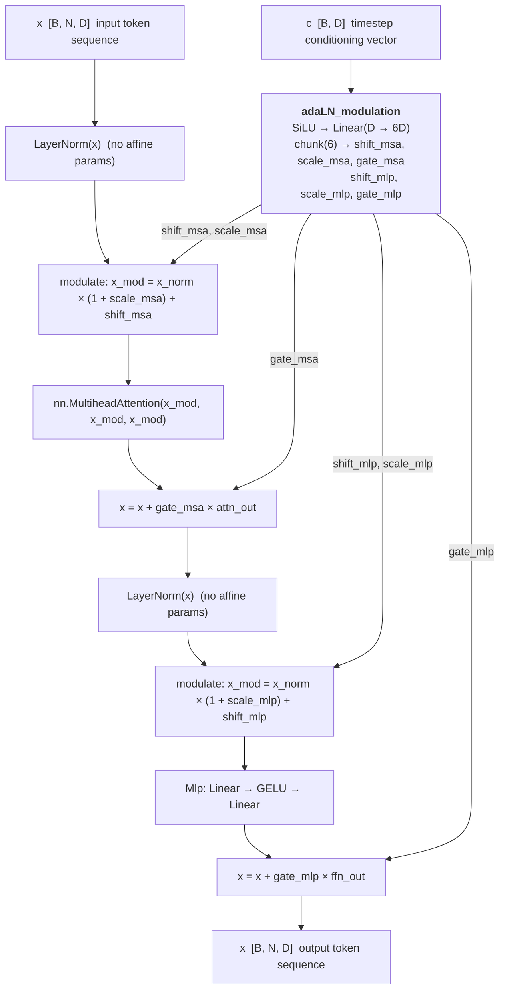
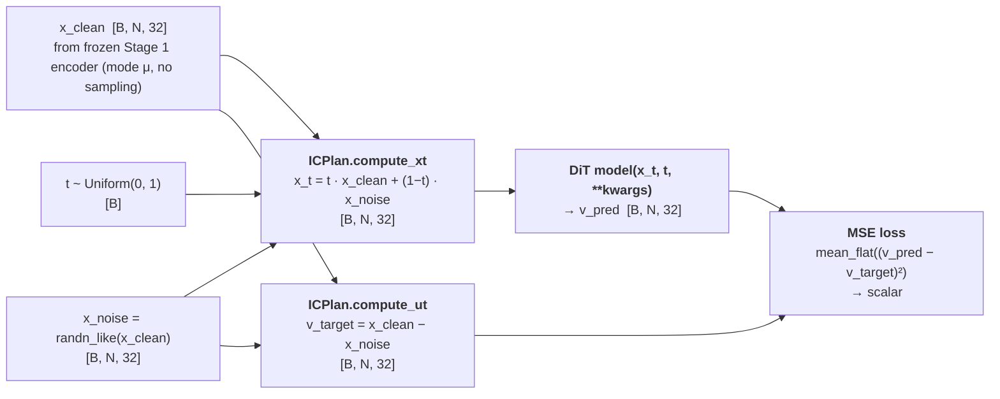
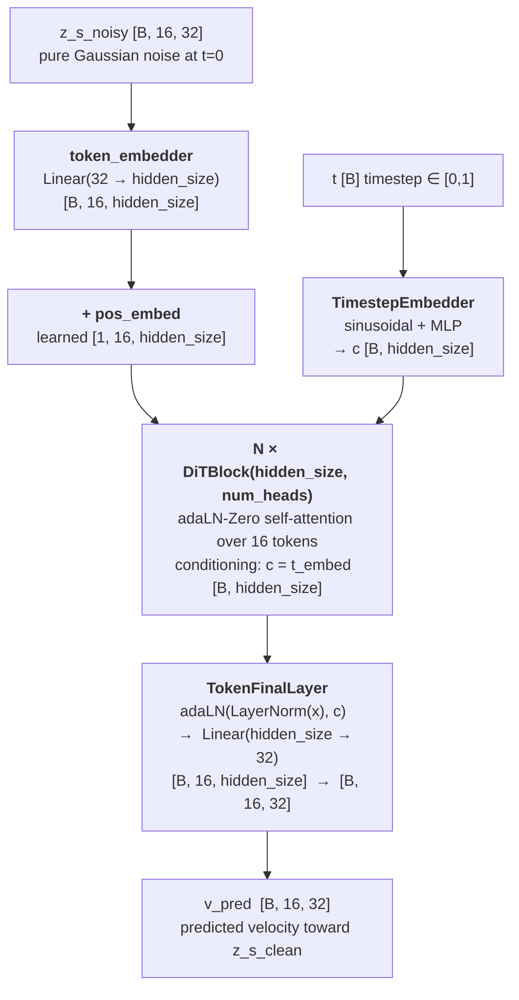
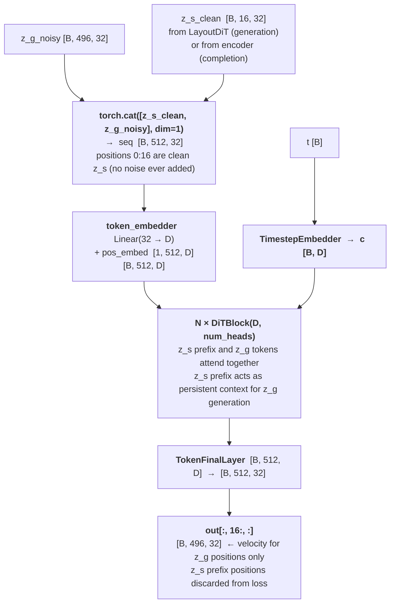
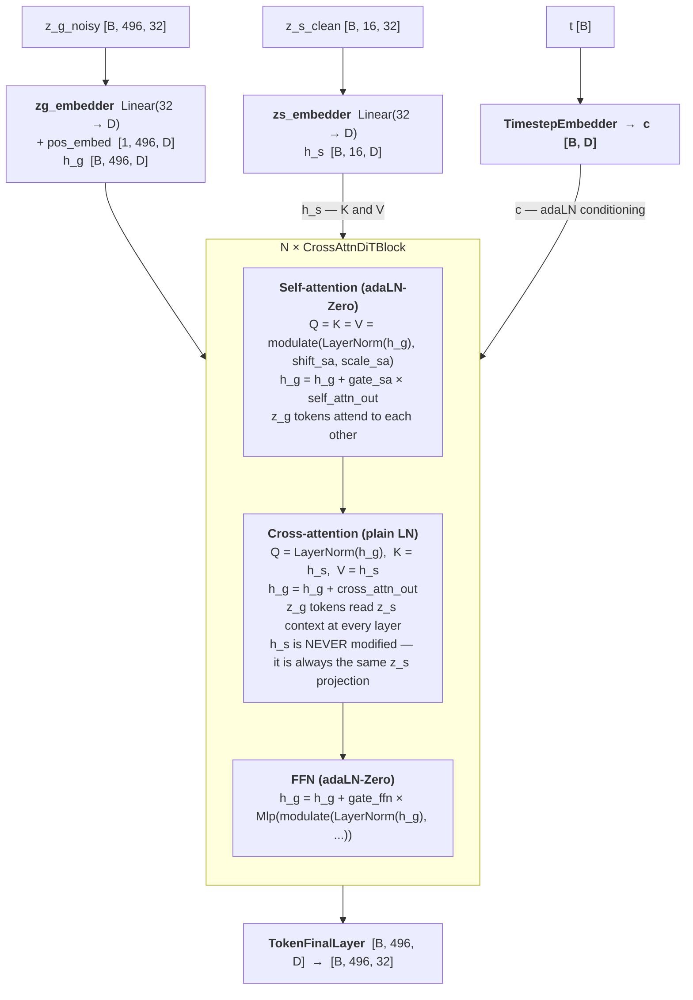
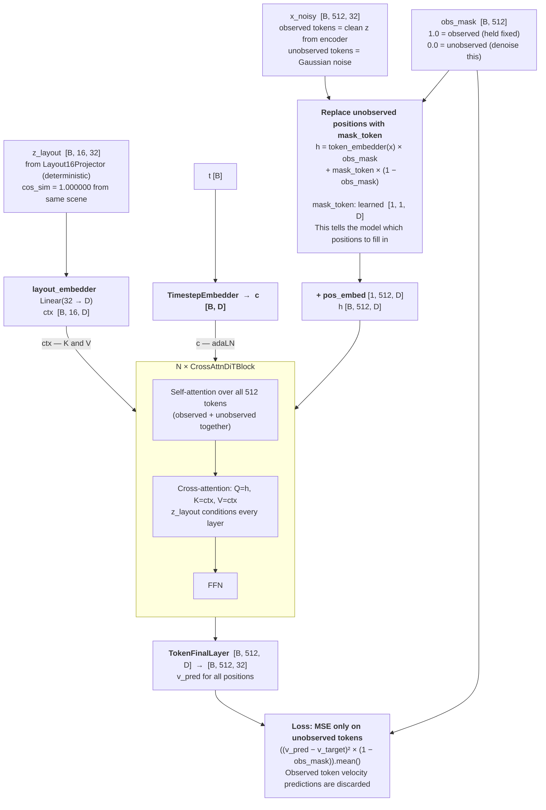
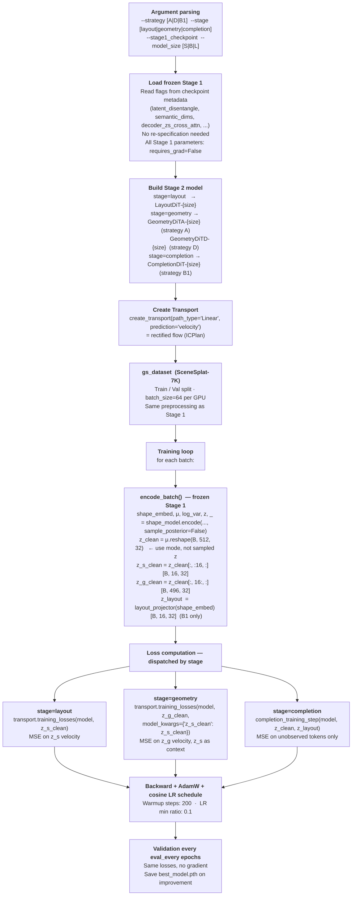
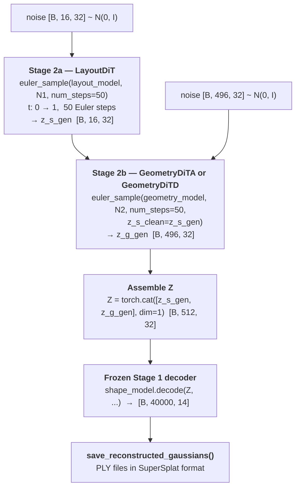
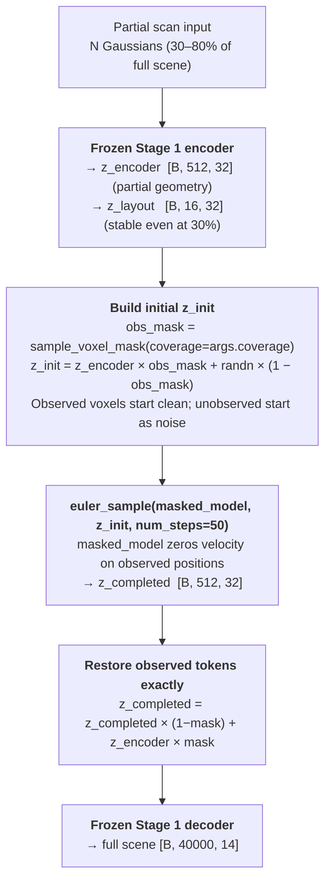

# Can3Tok VAE — Stage 2: Hierarchical Scene Generation

Stage 2 learns to generate the latent space produced by the frozen Stage 1 encoder.
A flow matching DiT transforms Gaussian noise into the structured latents `Z [B, 512, 32]`
that the Stage 1 decoder reconstructs into full 3DGS scenes.

Built on [DiT](https://github.com/facebookresearch/DiT) (Peebles & Xie, ICCV 2023) and
[SiT](https://github.com/willisma/SiT) (Ma et al., ECCV 2024).

---

## Table of Contents

1. [Overview and Design Rationale](#1-overview-and-design-rationale)
2. [Repository Structure](#2-repository-structure)
3. [External Dependencies](#3-external-dependencies)
4. [Building Blocks — `external/dit_block.py`](#4-building-blocks--externaldot_blockpy)
5. [Flow Matching — `external/transport/`](#5-flow-matching--externaltransport)
6. [Stage 2 Models](#6-stage-2-models)
   - 6.1 [LayoutDiT — `models/layout_dit.py`](#61-layoutdit--modelslayout_ditpy)
   - 6.2 [GeometryDiTA — Strategy A](#62-geometryditastrategy-a)
   - 6.3 [GeometryDiTD — Strategy D](#63-geometryditd--strategy-d)
   - 6.4 [CompletionDiT — Strategy B1](#64-completiondit--strategy-b1)
7. [Training Pipeline — `train_stage2.py`](#7-training-pipeline--train_stage2py)
8. [Inference — `sample_stage2.py`](#8-inference--sample_stage2py)
9. [SLURM Job Scripts](#9-slurm-job-scripts)
10. [Strategy Comparison](#10-strategy-comparison)
11. [What to Set Before Running](#11-what-to-set-before-running)

---

## 1. Overview and Design Rationale

Stage 1 (Can3Tok VAE) compresses a 3DGS scene of 40,000 Gaussians into a structured
latent `Z [B, 512, 32]`. Stage 2 learns the distribution `P(Z)` so that new scenes can
be generated from noise alone, without any encoder at inference time.

**Core idea: flow matching on the latent space.**
Instead of running a diffusion model directly on Gaussians (high-dimensional, unstructured),
we use the Stage 1 VAE as a learned perceptual compressor and generate in its latent space.
This is analogous to Stable Diffusion generating in the VAE latent space rather than in
pixel space, except our "pixels" are Gaussian splatting attributes.

**Why two stages of DiTs?**
`Z [B, 512, 32]` has two semantically distinct parts:

- `z_s = Z[:, 0:16, :]` — 16 semantic tokens encoding scene type, colour palette, object layout
- `z_g = Z[:, 16:, :]` — 496 geometry tokens encoding detailed spatial structure

Generating both jointly from a single DiT is harder than necessary. A two-stage hierarchy
matches the encoder structure: first generate *what kind of scene* (z_s), then generate
*the detailed geometry* given that context (z_g). This decomposition is well-supported by
DALL-E 2 / DALL-E 3 style hierarchical generation, and by the Stage 1 ablations showing that
z_s and z_g encode distinct information.

**Strategy B1 is the exception.** Its `z_layout` is deterministic (not KL-regularised in
Stage 1), so there is no distribution to sample from. Stage 2 for B1 is completion only —
a partial scan provides `z_layout` deterministically, and the DiT completes the geometry.

---

## 2. Repository Structure

Place this entire `stage2/` folder inside the Can3Tok root:

```
Can3Tok/
├── gs_can3tok_2.py                     # Stage 1 training loop
├── gs_dataset_scenesplat.py            # Dataset
├── model/                              # Stage 1 model definitions
│
└── stage2/                             # ← this folder
    ├── __init__.py
    │
    ├── external/                       # Verbatim or lightly adapted external code
    │   ├── __init__.py
    │   ├── dit_block.py                # Building blocks from DiT (Apache 2.0)
    │   └── transport/                  # Flow matching from SiT (MIT)
    │       ├── __init__.py             # create_transport() factory
    │       ├── path.py                 # ICPlan / VPCPlan / GVPCPlan
    │       ├── transport.py            # Transport class + training_losses()
    │       ├── utils.py                # EasyDict, mean_flat, log_state
    │       └── integrators.py          # sde / ode solvers
    │
    ├── models/                         # Our new model architectures
    │   ├── __init__.py
    │   ├── layout_dit.py               # Stage 2a: generates z_s [B,16,32]
    │   ├── geometry_dit.py             # Stage 2b: generates z_g [B,496,32]
    │   └── completion_dit.py           # Strategy B1: completes partial Z
    │
    ├── train_stage2.py                 # Unified training script (all 3 strategies)
    ├── sample_stage2.py                # Generation + completion inference
    │
    └── job_scripts/
        ├── accelerate_config.yaml      # 2× H100 DDP + bf16
        ├── run_stage2_A.job            # Strategy A SLURM job
        ├── run_stage2_D.job            # Strategy D SLURM job
        └── run_stage2_B1.job           # Strategy B1 SLURM job
```

---

## 3. External Dependencies

Stage 2 uses two external open-source libraries as building blocks. The relevant files
are copied into `external/` rather than installed as packages, which avoids dependency
version conflicts and makes the exact code used fully explicit.

### 3.1 DiT — `external/dit_block.py`

**Source:** [facebookresearch/DiT](https://github.com/facebookresearch/DiT)  
**Reference:** Peebles & Xie, *Scalable Diffusion Models with Transformers*, ICCV 2023  
**License:** Apache 2.0

DiT introduces the **adaLN-Zero** conditioning mechanism: each transformer block
modulates its LayerNorm parameters using the timestep embedding, with the modulation
initialised to zero (so each block starts as an identity transform and grows gradually
during training). This is the key contribution we reuse.

**What we take:**
- `modulate()` — the core adaLN scaling operation
- `TimestepEmbedder` — sinusoidal embeddings + 2-layer MLP for timestep → conditioning vector
- `DiTBlock` — the full adaLN-Zero transformer block

**What we adapt:**
- Replace `timm.Attention` with `nn.MultiheadAttention(batch_first=True)` — removes the `timm`
  dependency entirely while preserving identical behaviour
- Replace `timm.Mlp` with a local 2-layer GELU MLP class
- Replace image-specific `FinalLayer(patch_size², channels)` with `TokenFinalLayer(token_dim=32)`
  — outputs one 32-dim vector per token instead of one flattened image patch

**What we discard:**
- `DiT` (the full image model) — PatchEmbed, 2D sinusoidal PE, class conditioning
- `LabelEmbedder` — class label conditioning with dropout
- `get_2d_sincos_pos_embed*` — 2D image positional embeddings

### 3.2 SiT — `external/transport/`

**Source:** [willisma/SiT](https://github.com/willisma/SiT)  
**Reference:** Ma et al., *Sit: Exploring flow and diffusion-based generative models with scalable interpolant transformers*, ECCV 2024  
**License:** MIT

SiT extends DiT with **flow matching** (also called interpolant transport or rectified flow).
Instead of the DDPM noise schedule, it interpolates linearly between data and noise:
`x_t = t · x_clean + (1 − t) · x_noise`, and trains the model to predict the velocity
`v = x_clean − x_noise`. This is the same as rectified flow (Liu et al., 2022).

**What we take verbatim:**
- `path.py` — `ICPlan` (linear), `VPCPlan` (VP), `GVPCPlan` (cosine) path classes
- `transport.py` — `Transport` class with `training_losses()` and ODE/SDE drift functions
- `utils.py` — `EasyDict`, `mean_flat`, `log_state`
- `integrators.py` — `sde` and `ode` solver classes
- `__init__.py` — `create_transport()` factory

**One fix applied to `integrators.py`:** the source file contained two URL-encoded
hyperlinks that produced invalid Python syntax:
- `[th.no](http://th.no)_grad()` → `th.no_grad()`
- `[self.t.to](http://self.t.to)(device)` → `self.t.to(device)`

These are fixed in our copy. Everything else is verbatim.

**Why flow matching over DDPM?**
- Training is more stable — no discrete noise schedule to tune
- Inference can use as few as 20–50 Euler steps vs 250–1000 DDPM steps
- Straight-line trajectories in latent space are easier to learn than curved DDPM paths

---

## 4. Building Blocks — `external/dit_block.py`

```
external/dit_block.py
├── modulate(x, shift, scale)        — adaLN scaling: x * (1 + scale) + shift
├── Mlp                              — 2-layer GELU MLP replacing timm.Mlp
├── TimestepEmbedder                 — sinusoidal + MLP  →  [B, hidden_size]
├── DiTBlock                         — adaLN-Zero self-attention block
├── TokenFinalLayer                  — final projection  [B,N,D]  →  [B,N,32]
└── init_dit_weights()               — Xavier + zero-init adaLN + normal TimestepEmbedder
```

**`DiTBlock` in detail:**



**adaLN-Zero trick:** `adaLN_modulation[-1].weight` and `.bias` are initialised to zero.
At the start of training, every gate is 0, every shift/scale is 0/1 → each block acts as a
perfect identity. This allows very deep networks (12–16 blocks) to train stably from scratch.

---

## 5. Flow Matching — `external/transport/`

```
external/transport/
├── __init__.py          create_transport(path_type, prediction, ...)  →  Transport
├── path.py              ICPlan / VPCPlan / GVPCPlan  — path coefficients and plan()
├── transport.py         Transport.training_losses()  +  Sampler
├── utils.py             EasyDict, mean_flat, log_state
└── integrators.py       sde class, ode class  (Euler / Heun / dopri5)
```

**We use:** `path_type="Linear"`, `prediction="velocity"` → `ICPlan` (rectified flow).

### How `training_losses()` works



**Why we use `mu` (mode) not sampled `z` as the clean target:**
The Stage 1 encoder has `sample_posterior=False`, which returns the mean μ directly.
Using μ removes the sampling noise from Stage 2's training targets — the DiT only needs to
learn the deterministic structure, not the per-sample noise floor of the reparameterisation.

### Euler sampling at inference

```python
def euler_sample(model, x_init, num_steps=50, **model_kwargs):
    x, dt = x_init, 1.0 / num_steps
    for i in range(num_steps):
        t = torch.full((x.shape[0],), i / num_steps, device=x.device)
        x = x + model(x, t, **model_kwargs) * dt
    return x
```

50 Euler steps is sufficient for high-quality samples in the linear path setting.
This avoids the `torchdiffeq` dependency at inference time while matching the
ODE integrators in `integrators.py` for training consistency checks.

---

## 6. Stage 2 Models

### 6.1 LayoutDiT — `models/layout_dit.py`

**Task:** Generate `z_s [B, 16, 32]` (semantic layout tokens) from Gaussian noise.  
**Used by:** Strategy A and Strategy D (both share the same LayoutDiT checkpoint).



**Default preset (LayoutDiT-B):**

| Param | Value |
|---|---|
| `hidden_size` | 256 |
| `depth` | 6 |
| `num_heads` | 8 |
| Parameters | ~7M |

Smaller than the geometry models because z_s is only 16 tokens and encodes coarse
scene-type information — a shallow model is sufficient and trains faster.

---

### 6.2 GeometryDiTA — Strategy A

**File:** `models/geometry_dit.py`  
**Task:** Generate `z_g [B, 496, 32]` conditioned on a clean `z_s [B, 16, 32]` prefix.  
**Conditioning:** z_s is **prepended** as the first 16 tokens of the sequence. All 512 tokens
attend to each other freely via self-attention. Loss computed only on the last 496 positions.



**Why prefix conditioning (not cross-attention)?**
In Strategy A, the VAE decoder also processes z_s and z_g together in self-attention.
Matching this structure in Stage 2 means the DiT learns to use z_s in the same way the
decoder uses it — the representations are already aligned in the right space.

---

### 6.3 GeometryDiTD — Strategy D

**File:** `models/geometry_dit.py`  
**Task:** Generate `z_g [B, 496, 32]` with `z_s [B, 16, 32]` as **cross-attention K/V per layer**.  
**Key insight:** This directly mirrors the `ZSCondTransformerDecoder` in the Stage 1 VAE
decoder for Strategy D. The DiT is learning to invert the exact conditioning structure that
the VAE decoder uses — so the generated (z_s, z_g) pairs are already in the right space.



**CrossAttnDiTBlock design notes:**
- Self-attention uses full adaLN-Zero (6 params from `adaLN_modulation`): shift + scale + gate
  for both self-attn and FFN.
- Cross-attention uses only a plain LayerNorm on the query side — no adaLN on cross-attention.
  The rationale: the timestep should modulate how much the geometry self-attends (since that
  is the denoising operation), but z_s conditioning is always fully active regardless of t.
- There is no gate on the cross-attention output (`h_g = h_g + ca_out`, not gated). This
  ensures z_s always has a gradient path to every layer.

---

### 6.4 CompletionDiT — Strategy B1

**File:** `models/completion_dit.py`  
**Task:** Complete partial geometry `Z [B, 512, 32]` conditioned on deterministic `z_layout [B, 16, 32]`.  
**Training:** Random masks of 30–80% coverage simulate partial scans at varying completeness.



**`completion_training_step()` in detail:**

```
1. Sample obs_mask: coverage ∈ Uniform(0.3, 0.8) per scene → binary mask [B, 512]
2. Sample t ∈ Uniform(0, 1) and z_noise = randn_like(z_clean)
3. Build x_t:
   - unobserved: t·z_clean + (1-t)·z_noise   (noisy)
   - observed:   z_clean                      (always clean)
4. v_target = z_clean − z_noise               (same for all positions)
5. v_pred = model(x_t, t, z_layout, obs_mask)
6. loss = MSE(v_pred, v_target) masked to unobserved positions
```

**Why B1 excels at completion:**
`z_layout` is produced by a deterministic MLP (`Layout16Projector`) — no sampling noise.
The same partial scan always produces identical `z_layout`, so even at 40% coverage the
conditioning signal is accurate (cosine similarity 0.761 vs 1.000 for full scan). The
CompletionDiT sees a stable, reliable scene-type descriptor as K/V at every layer.

---

## 7. Training Pipeline — `train_stage2.py`

Single script handles all three strategies and both stages.



**`encode_batch()` is the critical bridge between Stage 1 and Stage 2.**
The frozen Stage 1 model runs on every batch to produce clean target latents.
This adds ~30ms per step on H100 but avoids the alternative of pre-computing and
storing all latents (which would require ~200GB for SceneSplat-7K at float32).

**Stage 1 flags auto-detection:**
```python
ckpt  = torch.load(stage1_checkpoint)
flags = {k: ckpt.get(k, default) for k in [
    'latent_disentangle', 'semantic_dims', 'color_residual',
    'decoder_zs_cross_attn', 'decoder_layout_cross_attn', ...
]}
```
The correct Stage 1 model is reconstructed from these flags. You never need to specify
Stage 1 flags on the command line for Stage 2 training.

---

## 8. Inference — `sample_stage2.py`

### Generation (Strategy A / D)



### Completion (Strategy A / D / B1)



---

## 9. SLURM Job Scripts

All three jobs follow the same structure:

```
job_scripts/
├── accelerate_config.yaml   2 GPUs, bf16 mixed precision, static NCCL
├── run_stage2_A.job         Strategy A (layout → geometry in 2 submissions)
├── run_stage2_D.job         Strategy D (layout can be reused from A)
└── run_stage2_B1.job        Strategy B1 (single submission, completion only)
```

**Before submitting any job, set `STAGE1_CHECKPOINT`** to your Stage 1 `best_model.pth`.

### Strategy A workflow

```bash
# Step 1: Train Layout DiT (~200–300 epochs)
# In run_stage2_A.job: STAGE="layout"
sbatch job_scripts/run_stage2_A.job

# Step 2: Train Geometry DiT A
# In run_stage2_A.job: STAGE="geometry", LAYOUT_CKPT="...layout.../best_model.pth"
sbatch job_scripts/run_stage2_A.job
```

### Strategy D workflow

```bash
# If you already trained Strategy A, the layout checkpoint is reusable:
# In run_stage2_D.job: STAGE="geometry", LAYOUT_CKPT="<Strategy A layout checkpoint>"
sbatch job_scripts/run_stage2_D.job

# If not, train layout first (identical to Strategy A layout step):
# In run_stage2_D.job: STAGE="layout"
sbatch job_scripts/run_stage2_D.job
```

### Strategy B1 workflow

```bash
# Single submission — no layout stage
sbatch job_scripts/run_stage2_B1.job
```

**Checkpoint naming convention:**
All checkpoints are saved to:
```
Can3Tok/checkpoints_stage2/stage2_{strategy}_{stage}_{size}_{SLURM_JOB_ID}/
    best_model.pth     ← lowest val loss
    epoch_NNN.pth      ← periodic save every 100 epochs
    final.pth          ← last epoch
```

---

## 10. Strategy Comparison

| Property | Strategy A | Strategy D | Strategy B1 |
|---|---|---|---|
| z_s source | VAE posterior (stochastic) | VAE posterior (stochastic) | Layout16Projector (deterministic) |
| z_s in Z? | Yes (tokens 0–15) | Yes (tokens 0–15) | No (separate tensor) |
| KL on z_s | Yes | Yes | No |
| Unconditional generation | Yes | Yes | No |
| Scene completion | Yes, moderate | Yes, moderate | Yes, **excellent** |
| Stage 2a | LayoutDiT on z_s [B,16,32] | LayoutDiT on z_s [B,16,32] | N/A |
| Stage 2b | GeometryDiTA (prefix concat) | GeometryDiTD (cross-attn K/V) | CompletionDiT |
| Mirrors VAE decoder? | Partial (self-attn) | **Exact** (cross-attn) | **Exact** (cross-attn) |
| Partial obs @40% Stage 1 | 0.365 | ~0.37–0.76 (expected) | **0.761** |
| Stage 2 submissions | 2 (layout + geometry) | 2 (layout + geometry) | 1 (completion only) |
| Can share layout ckpt? | — | Yes, from Strategy A | N/A |
| Stage 2 model sizes | ~7M + ~55M | ~7M + ~65M | ~65M |

**Model size presets:**

| Preset | hidden_size | depth | num_heads | Params |
|---|:---:|:---:|:---:|:---:|
| `-S` | 128–256 | 4–8 | 4–8 | ~2–10M |
| `-B` (default) | 256–384 | 6–12 | 8–12 | ~7–65M |
| `-L` | 384–512 | 8–16 | 12–16 | ~25–130M |

---

## 11. What to Set Before Running

**Stage 1 checkpoint:** Set `STAGE1_CHECKPOINT` in the job script or `--stage1_checkpoint` on the CLI.
The correct Strategy must match: use a Strategy A/D checkpoint for generation DiTs, a
Strategy B1 checkpoint for CompletionDiT.

**Layout checkpoint (Strategy D, Stage 2b only):** If you already have a Strategy A
LayoutDiT checkpoint, you can reuse it directly for Strategy D — the target latent
`z_s = Z[:, 0:16, :]` is identical regardless of strategy.

**Config check:** The Stage 1 model flags are read automatically from the checkpoint.
You do not need to specify `--latent_disentangle`, `--decoder_zs_cross_attn`, etc. for Stage 2.

**Quick test before full training:**
```bash
# Smoke test: 5 scenes, 5 epochs, size S — confirms imports and data loading work
accelerate launch stage2/train_stage2.py \
    --strategy A --stage layout \
    --stage1_checkpoint /path/to/best_model.pth \
    --model_size S --batch_size 4 --num_epochs 5 --train_scenes 5 --val_scenes 2
```

---

## References

1. **DiT** — Peebles, W. & Xie, S. (2023). *Scalable Diffusion Models with Transformers.*
   ICCV 2023. [arXiv:2212.09748](https://arxiv.org/abs/2212.09748).
   GitHub: [facebookresearch/DiT](https://github.com/facebookresearch/DiT). Apache 2.0.
   → adaLN-Zero conditioning, `DiTBlock`, `TimestepEmbedder`

2. **SiT** — Ma, N. et al. (2024). *SiT: Exploring Flow and Diffusion-based Generative Models
   with Scalable Interpolant Transformers.* ECCV 2024. [arXiv:2401.08740](https://arxiv.org/abs/2401.08740).
   GitHub: [willisma/SiT](https://github.com/willisma/SiT). MIT License.
   → `ICPlan` rectified flow path, `Transport`, `training_losses()`, `sde`, `ode`

3. **Rectified Flow** — Liu, X. et al. (2022). *Flow Straight and Fast: Learning to Generate
   and Transfer Data with Rectified Flow.* ICLR 2023. [arXiv:2209.03003](https://arxiv.org/abs/2209.03003).
   → Mathematical foundation for the linear interpolation path used in `ICPlan`

4. **Can3Tok / SceneSplat** — Stage 1 architecture. The Stage 2 latent space target is
   the encoder mode `μ` from the Can3Tok VAE. [arXiv:2501.01895](https://arxiv.org/abs/2501.01895).

5. **EncDiff** — Theoretical support for cross-attention as a disentanglement inductive bias
   between concept tokens and geometry tokens. NeurIPS 2024 Spotlight.
   → Motivation for Strategy D's cross-attention decoder (see Stage 1 README §6)

6. **Flow Matching for Generative Modeling** — Lipman, Y. et al. (2022).
   [arXiv:2210.02747](https://arxiv.org/abs/2210.02747). → Flow matching training objective.

7. **Stable Diffusion** — Rombach, R. et al. (2022). *High-Resolution Image Synthesis with
   Latent Diffusion Models.* CVPR 2022. [arXiv:2112.10752](https://arxiv.org/abs/2112.10752).
   → Inspiration for generating in the VAE latent space rather than in Gaussian attribute space.